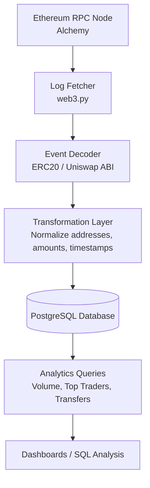

Web3 ERC-20 Indexer (Ethereum)

A minimal, production-style ERC-20 Transfer and Uniswap pool swaps indexer for Ethereum mainnet.

This project connects directly to an Ethereum JSON-RPC node, fetches on-chain Transfer events, decodes them using ABI, and stores normalized data in PostgreSQL for analytics and downstream use.

Architecture overview

Ingestion flow:
- Fetch logs via eth_getLogs (address + topic filtered)
- Decode events using ERC-20 ABI
- Collect unique block numbers
- Batch-fetch block timestamps
- Normalize and bulk-insert into PostgreSQL

Data model highlights:
- One row per (tx_hash, log_index)
- No assumptions about “one transfer per transaction”
- Addresses and hashes stored as raw bytes (20 / 32 bytes)

## Architecture

## Key Design Decisions

- **Bytea storage for hashes and addresses** to reduce storage footprint
- **Composite primary key (tx_hash, log_index)** to guarantee event uniqueness
- **Indexed block_time** to support time-based analytics queries
- **Batch inserts using execute_values** to improve ingestion performance
- **RPC pagination** to handle free-tier block range limits

Run file: transfers.py for transfers, uni.py for uniswap swaps in ETH/USDC pool
Database entities: in folder sql/ddl/

Requirements
- Python 3.09
- PostgreSQL 14+
- Ethereum JSON-RPC endpoint

Python dependencies:
- web3
- psycopg2
- python-dotenv
- requests